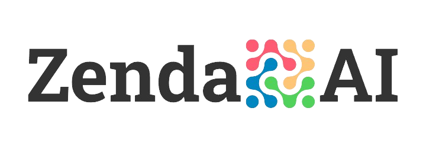

    <h1 align="center">WEBSITE</h1>

    <h1 align="center"><a href="https://zenda-ai.vercel.app/">ZendaAI</a></h1>

    <em>Login with test data: ematprodev@gmail.com : Test12345</em>

  

    <h1 align="center">Zenda AI</h1>

## Overview

MicroTransAI is an innovative software project designed around the Next.js framework, leveraging modern web technologies for seamless language translation and transcription services. It supports user authentication, dynamic data interaction with MongoDB, and integrates with Azure AI services to facilitate real-time text and audio processing. The application ensures a responsive and accessible user interface, enriched with TailwindCSS for aesthetic consistency across devices. MicroTransAI enhances user engagement by providing translational history, audio transcription capabilities, and secure data management, making it a comprehensive solution for users needing immediate and accurate language translation services.

## ZendaAI App Features

1. **AI-Powered Chatbot**: Engage users with a responsive AI chatbot that provides instant answers and assistance.
2. **Real-Time Messaging**: Experience seamless real-time communication between users and the chatbot.
3. **Help Desk Integration**: Access a comprehensive help desk feature that allows users to browse frequently asked questions.
4. **User-Friendly Interface**: Enjoy an intuitive and visually appealing interface designed for ease of use.
5. **Multi-Domain Support**: Manage multiple domains and customize chatbot settings for each domain.
6. **Appointment Scheduling**: Users can easily book appointments through the integrated scheduling system.
7. **Email Notifications**: Receive timely email notifications for important updates and interactions.
8. **Analytics Dashboard**: Gain insights into user interactions and chatbot performance through an analytics dashboard.
9. **File Upload Capability**: Users can upload files directly during chat interactions for enhanced support.
10. **Customizable Themes**: Personalize the chatbot's appearance with customizable themes and color schemes.

## Technology Stack

- **Frontend**: Next.js, React, TypeScript, Tailwind CSS
- **Backend**: Node.js, Express, Prisma ORM
- **Database**: PostgreSQL
- **AI Integration**: OpenAI API
- **Authentication**: Clerk
- **Real-Time Communication**: Pusher
- **File Uploads**: Uploadcare
- **State Management**: React Hook Form
- **Deployment**: Vercel
